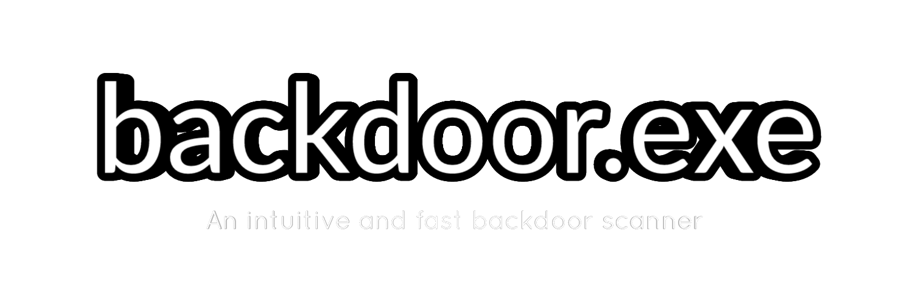

<h2 align="center"> 
  
  
  
  
</h2>

An in game interface/tool to scan every remote for backdoors.  
**Tool was made to find backdoors in your game.**

<!--- ### ✨ [Demo](https://demo.url/) Comming soon ;) --->

# Contributing
Contributions, issues and feature requests are welcome! Feel free to check [issues page](https://github.com/iK4oS/backdoor.exe/issues).
* Undetected backdoors reports are appreciate as contribute to provide the best updated backdoor scanner out there.

# Show your support
Give a ⭐️ if this project helped you or join our [Discord](https://discord.com/invite/xJHCqm84cW) !

# 📝 License

Copyright © 2021 [iK4oS](https://github.com/iK4oS). 
This project is [GPL-3.0](https://github.com/iK4oS/backdoor.exe/blob/master/LICENSE) licensed.
